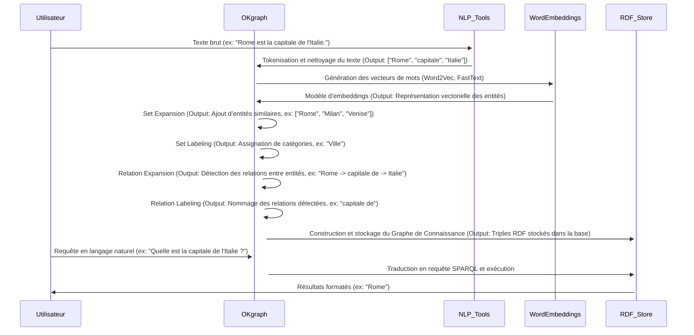
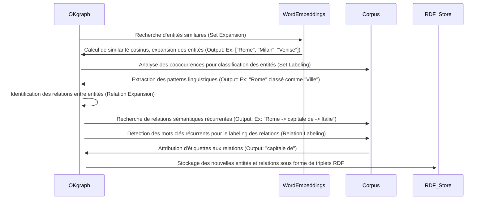
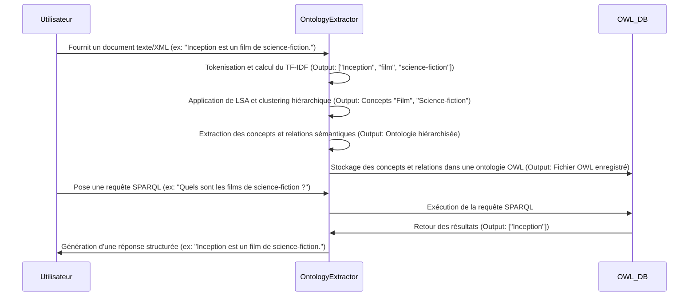
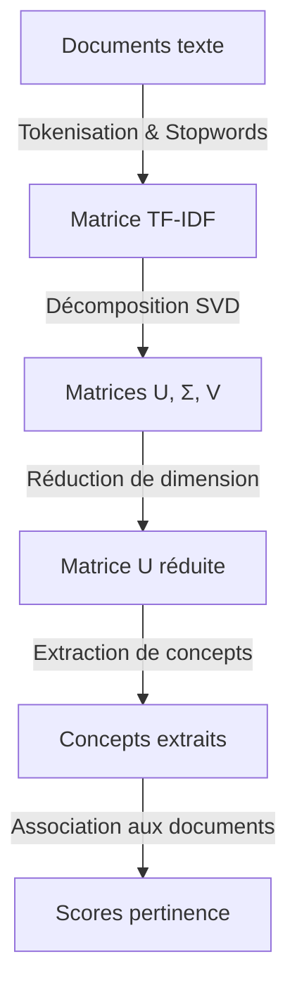
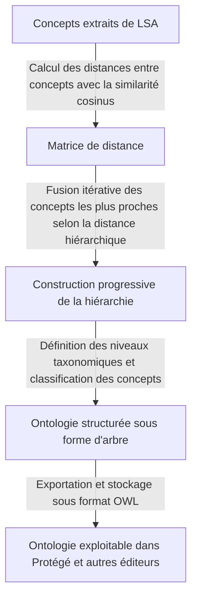

# 📌 Processus Détaillé des Deux Approches avec Exemples Concrets d’Inputs/Outputs et Diagrammes de Séquences

## 🔷 Article 1 : Extraction et Interrogation de Graphes de Connaissances avec OKgraph

### 1. Diagramme de Séquence : Extraction et Interrogation de Graphes de Connaissances


### 2. Diagramme Explicatif : Détails du Fonctionnement des Étapes Clés (Set Expansion, Set Labeling, Relation Expansion, Relation Labeling)


### 2. Explication détaillée :
- **Set Expansion** : Trouve des entités similaires en utilisant **des embeddings de mots et la similarité cosinus**.
  - **Méthode** : OKgraph utilise un **modèle pré-entraîné** de Word Embeddings (Word2Vec, FastText) pour rechercher **des mots proches dans l'espace vectoriel**.
  - **Exemple** :
    - **Input** : `["Rome", "Milan", "Bari"]`
    - **Traitement** : Recherche des entités ayant **des vecteurs proches** dans un **modèle pré-entraîné sur un grand corpus** (ex: Wikipédia, articles scientifiques).
    - **Output** : `["Venise", "Naples", "Turin"]` → Entités similaires trouvées.

- **Set Labeling** : Associe une **catégorie aux entités** en analysant **leurs cooccurrences** dans un corpus.
  - **Méthode** : OKgraph scanne des documents textuels pour voir **quels mots apparaissent souvent à côté des entités détectées**.
  - **Exemple** :
    - **Input** : `["Rome", "Venise"]`
    - **Traitement** : Recherche des phrases contenant ces mots : `["Rome est une ville ancienne.", "Venise est une ville d'art."]`
    - **Analyse** : Les mots `"ville"` et `"ancienne"` apparaissent fréquemment avec `"Rome"`, donc `"Rome"` est classé comme **Ville**.
    - **Output** : `"Ville"` → Catégorie attribuée.

- **Relation Expansion** : Identifie de **nouvelles relations** en étudiant les **patterns contextuels**.
  - **Méthode** : OKgraph **prend des relations connues** et les étend en recherchant **des entités similaires** et **des associations sémantiques** dans un corpus.
  - **Exemple** :
    - **Input** : `[(Italie, Rome), (France, Paris)]` (relation connue : `"capitale de"`)
    - **Traitement** :
      - **Expansion des entités** (`Italie` → `Espagne`, `France` → `Portugal`)
      - **Expansion des villes associées** (`Rome` → `Madrid`, `Paris` → `Lisbonne`)
      - **Création de nouvelles paires** (`[(Espagne, Madrid), (Portugal, Lisbonne)]`)
    - **Output** : `[(Espagne, Madrid), (Portugal, Lisbonne)]` → Nouvelles relations détectées.

- **Relation Labeling** : Attribue un **nom aux relations détectées** en **analysant les mots récurrents** entre les entités.
  - **Méthode** : OKgraph recherche **les mots qui apparaissent souvent entre deux entités** et leur **attribue une étiquette en fonction de la fréquence**.
  - **Exemple** :
    - **Input** : `[(Italie, Rome)]`
    - **Corpus analysé** :
      - `"Rome est la capitale de l'Italie."`
      - `"Paris est la capitale de la France."`
      - `"Madrid est la capitale de l'Espagne."`
    - **Traitement** :
      - Recherche des **mots fréquents entre les paires d'entités**.
      - `"capitale de"` apparaît dans **95% des cas** → c'est le label retenu.
    - **Output** : `"capitale de"` → Label attribué à la relation.

---


---

## 🔷 Article 2 : Extraction Automatique d’Ontologies à partir de Documents

### 1. Diagramme de Séquence : Extraction d'Ontologies Automatiques

**Exemple détaillé** :
- **Input** : Document XML contenant "Inception est un film de science-fiction réalisé par Christopher Nolan."
- **Étape 1** : Tokenisation → `['Inception', 'film', 'science-fiction', 'Christopher', 'Nolan']`
- **Étape 2** : TF-IDF calcule les scores d’importance des mots-clés.
- **Étape 3** : LSA extrait des concepts clés `['Film', 'Science-fiction']`.
- **Étape 4** : Clustering hiérarchique regroupe les termes associés dans une structure taxonomique.
- **Output final** : Une ontologie OWL stockée avec `Film` comme concept principal et `Science-fiction` comme sous-classe.

### 2. Diagramme Explicatif : Fonctionnement du LSA avec Exemples


### **1️⃣ Latent Semantic Analysis (LSA) et Singular Value Decomposition (SVD)**

- **Objectif** : Identifier les concepts cachés en réduisant la dimensionnalité d’une matrice de termes-document.
- **Étapes** :
  1. **Matrice terme-document (TF-IDF)** : Calcul de l’importance des mots.
  2. **Décomposition en valeurs singulières (SVD)** : Extraction des concepts principaux.
  3. **Réduction de dimension** : Sélection des concepts les plus pertinents.
  4. **Association aux documents** : Attribution des concepts aux documents.

- **Exemple** :
  - **Input** : `"Inception est un film de science-fiction réalisé par Christopher Nolan."`
  - **TF-IDF** : `{"Inception": 0.8, "film": 0.9, "science-fiction": 0.7}`
  - **Concepts extraits** : `Film, Science-fiction`
  - **Output** : `"Film de science-fiction"`

### 3. Diagramme Explicatif : Fonctionnement de l'Agglomerative Clustering avec Exemples

### **2️⃣ Clustering Hiérarchique pour structurer l'Ontologie**

- **Objectif** : Regrouper les concepts en une taxonomie hiérarchique.
- **Étapes** :
  1. **Calcul des distances entre concepts** (similarité cosinus).
  2. **Fusion des concepts proches** en clusters.
  3. **Définition des niveaux taxonomiques**.
  4. **Génération d’une ontologie OWL**.

- **Exemple** :
# 📌 Ontologie Hiérarchique avec Clustering Hiérarchique

## **🔹 Processus d'Extraction et Classification des Concepts**

### **🔹 Input**
Concepts initiaux :
```plaintext
["Film", "Science-fiction", "Thriller", "Drame"]
```

### **🔹 Étape 1 : Calcul des similarités cosinus entre les concepts**
Les distances sont calculées pour mesurer la proximité entre les concepts :
```plaintext
Sim(Film, Science-fiction) = 0.85
Sim(Film, Thriller) = 0.65
Sim(Film, Drame) = 0.50
Sim(Science-fiction, Thriller) = 0.30
```

### **🔹 Étape 2 : Fusion des concepts les plus similaires**
Les concepts ayant une **forte similarité** sont fusionnés :
```plaintext
"Film" et "Science-fiction" sont fusionnés en un seul nœud.
```

### **🔹 Étape 3 : Classification hiérarchique finale**
L'ontologie est organisée en une structure arborescente :
```plaintext
Cinéma
 ├── Science-fiction
 ├── Thriller
 ├── Drame
```


### **3️⃣ Génération de l'Ontologie en OWL**

```xml
<owl:Class rdf:ID="Film"/>
<owl:Class rdf:ID="Science-fiction">
   <rdfs:subClassOf rdf:resource="#Film"/>
</owl:Class>
<owl:Class rdf:ID="Thriller">
   <rdfs:subClassOf rdf:resource="#Film"/>
</owl:Class>
<owl:Class rdf:ID="Drame">
   <rdfs:subClassOf rdf:resource="#Film"/>
</owl:Class>
```

## 🔷 Comparaison des Avantages et Limites des Deux Approches

### **🟢 Avantages et 🔴 Limites de OKgraph (Article 1)**
| | OKgraph |
|-----------|------------|
| ✅ **Non supervisé** | Pas besoin d’annotation, fonctionne sur grands corpus non annotés. |
| ✅ **Expansion efficace** | Génère automatiquement des entités et relations via embeddings. |
| ✅ **Requêtage en langage naturel** | Répond aux questions via KGQA. |
| ✅ **Intégration RDF/SPARQL** | Compatible avec les bases RDF et requêtes SPARQL. |
| ❌ **Dépendance aux embeddings** | Performances liées à la qualité des embeddings (Word2Vec, FastText). |
| ❌ **Relations difficiles à interpréter** | Certaines relations peuvent être incorrectes ou trop générales. |
| ❌ **Sensibilité au contexte** | Peut échouer si le corpus est trop limité. |
| ❌ **Pas de structuration hiérarchique** | Ne crée pas de taxonomie ou de relations hiérarchiques. |

### **🟢 Avantages et 🔴 Limites de LSA + Clustering Hiérarchique (Article 2)**
| | LSA + Clustering |
|-----------|------------|
| ✅ **Taxonomie automatique** | Génère une hiérarchie de concepts. |
| ✅ **Catégorisation robuste** | LSA extrait des concepts même dans des corpus bruités. |
| ✅ **Interopérabilité OWL** | Résultats exportables pour Protégé et autres outils d'ontologie. |
| ✅ **Adaptable à divers domaines** | Fonctionne si le corpus est représentatif. |
| ❌ **Besoin d’un corpus riche** | Manque de diversité = biais dans les concepts extraits. |
| ❌ **Pas de requêtage en langage naturel** | Impossible d’interroger directement les connaissances. |
| ❌ **Interprétation difficile des concepts** | Les résultats LSA nécessitent une analyse approfondie. |
| ❌ **Dépendance aux paramètres du clustering** | Nécessite des réglages précis pour de bons résultats. |


