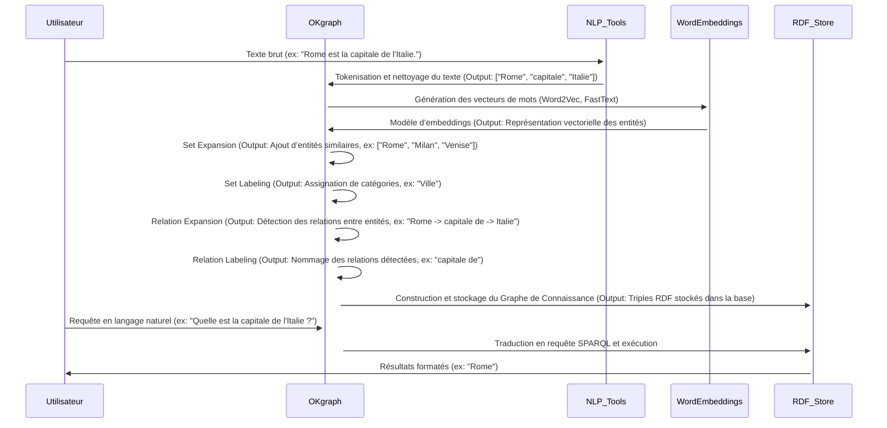
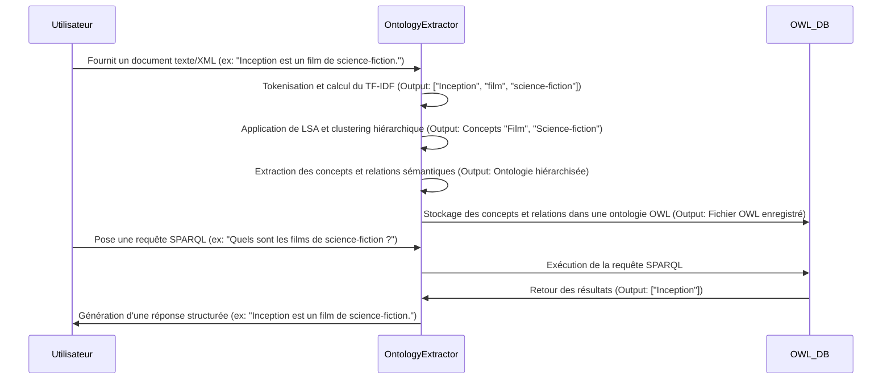
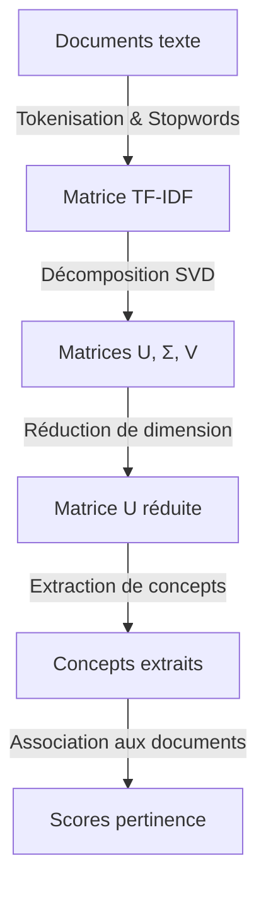
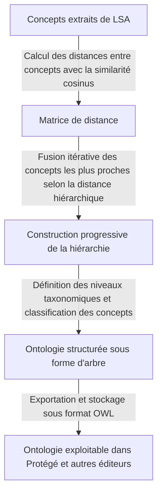

# 📌 Processus Détaillé des Deux Approches avec Exemples Concrets d’Inputs/Outputs et Diagrammes de Séquences

## 🔷 Article 1 : Extraction et Interrogation de Graphes de Connaissances avec OKgraph

### 1. Diagramme de Séquence : Extraction et Interrogation de Graphes de Connaissances

**Exemple détaillé** :
- **Input** : Texte brut "Rome est la capitale de l'Italie. Milan est une ville italienne."
- **Étape 1** : Tokenisation → `['Rome', 'capitale', 'Italie', 'Milan', 'ville', 'italienne']`
- **Étape 2** : Word Embeddings génère des vecteurs de mots pour identifier les relations et entités similaires.
- **Étape 3** : Set Expansion trouve des entités proches (ex: "Venise", "Naples").
- **Étape 4** : Set Labeling classe les entités extraites en "Ville", "Pays", etc.
- **Étape 5** : Relation Expansion détecte les liens entre les entités (`Rome -> capitale de -> Italie`).
- **Étape 6** : Relation Labeling attribue un nom aux relations (`capitale de`, `situé en`).
- **Output final** : Un graphe RDF stocké avec les triples `{("Rome", "capitale de", "Italie"), ("Milan", "situé en", "Italie")}`.

---

## 🔷 Article 2 : Extraction Automatique d’Ontologies à partir de Documents

### 1. Diagramme de Séquence : Extraction d'Ontologies Automatiques

**Exemple détaillé** :
- **Input** : Document XML contenant "Inception est un film de science-fiction réalisé par Christopher Nolan."
- **Étape 1** : Tokenisation → `['Inception', 'film', 'science-fiction', 'Christopher', 'Nolan']`
- **Étape 2** : TF-IDF calcule les scores d’importance des mots-clés.
- **Étape 3** : LSA extrait des concepts clés `['Film', 'Science-fiction']`.
- **Étape 4** : Clustering hiérarchique regroupe les termes associés dans une structure taxonomique.
- **Output final** : Une ontologie OWL stockée avec `Film` comme concept principal et `Science-fiction` comme sous-classe.

### 2. Diagramme Explicatif : Fonctionnement du LSA avec Exemples

**Exemple détaillé** :
- **Input** : "Les films de science-fiction sont captivants."
- **TF-IDF** : Matrice avec `['films', 'science-fiction', 'captivants']`.
- **SVD** : Décomposition en matrices U, Σ et V pour identifier les concepts dominants (`science-fiction` associé à `films`).
- **Output** : `Concept extrait = Science-fiction` avec `Score de pertinence = 0.89`.

### 3. Diagramme Explicatif : Fonctionnement de l'Agglomerative Clustering avec Exemples

**Exemple détaillé** :
- **Input** : Concepts `['Film', 'Science-fiction', 'Thriller', 'Drame']`
- **Étape 1** : Matrice de distance cosinus entre les termes (ex : `Sim(Film, Science-fiction) = 0.85`).
- **Étape 2** : Fusion des concepts ayant les plus fortes similarités (`Film` et `Science-fiction` sont fusionnés).
- **Étape 3** : Classification hiérarchique des concepts (`Thriller` et `Drame` sont placés sous `Cinéma`).
- **Output final** : Ontologie structurée avec `Cinéma → [Science-fiction, Thriller, Drame]`.

---

💡 **Ce fichier README.md structure clairement les processus des deux articles avec des diagrammes enrichis et détaillés pour une meilleure compréhension et implémentation !** 🚀

